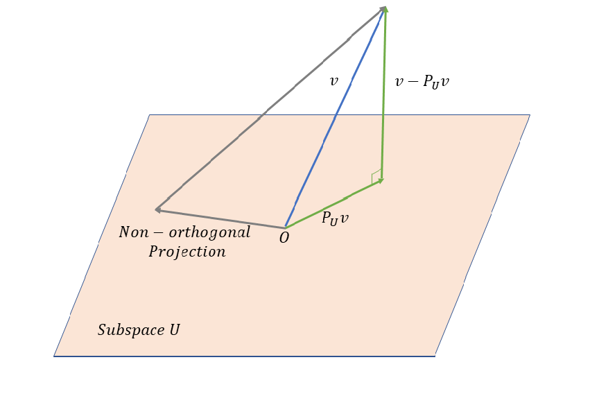

```{r setup, include=FALSE}
knitr::opts_chunk$set(echo = TRUE)
```

\def\vec{\overrightarrow}
\def\bfF{\mathbf{F}}
\def\calP{\mathcal{P}}
\def\calC{\mathcal{C}}
\def\calL{\mathcal{L}}
\def\calM{\mathcal{M}}
\def\R{\mathbb{R}}
\def\C{\mathbb{C}}
\def\N{\mathbb{N}}
\def\Z{\mathbb{Z}}
\def\span{\mathrm{span}\,}
\def\dim{\mathrm{dim}\,}
\def\Null{\mathrm{null}\,}
\def\range{\mathrm{range}\,}
\def\rank{\mathrm{rank}\,}
\def\proj{\mathrm{Proj}\,}
\def\st{\mathrm{s.t.}}
\def\d{\mathrm{d}\,}

# 线性空间上的结构

## 复习与思考

本章我们介绍了内积与范数的概念，并着重考察了内积空间。之前我们说引入线性空间这一概念的动机就是把一大类对象的本质给抽象出来，这样对抽象定义的线性空间推导的结论具有普遍性。但是我们之前抽象的太“多”了，导致有一些并非无关紧要的东西被忽略掉了。抽象到什么层次确实是一个很难的问题，我们可以忽略掉所有的性质，直接抽象成集合，但这样元素之间就没有什么关系了，也没什么可研究的。之前是抽象到线性空间这个层次，我们可以讨论元素之间的加法以及元素与标量的数乘了。现在我们希望讨论诸如“长度”和“夹角”这样的概念，这两个概念在平面和空间中是不言自明的，但是对更一般的线性空间并不是那么显然。其实后面讨论的“范数”就可以看成是“长度”的学名，“内积”也可以视为是“夹角”的别名。对于一般的空间，如何去谈论长度和夹角？我们仍然采用抽象的做法，从平面向量和夹角的性质中抽离出最本质的几条，然后说只要满足这么几条的东西就是“范数”或者“内积”。设$V$是$\bfF$上的一个线性空间，$V$上的内积$\langle\cdot,\cdot\rangle$就是一个$V\times V\rightarrow \bfF$的函数，满足如下几条性质：

- 正性: $\langle v,v\rangle\ge 0,\quad \forall v\in V.$ 
- 定性: $\langle v,v\rangle =0$当且仅当$v=0$.
- 加性: $\langle u+v,w\rangle = \langle u,w\rangle+\langle v,w\rangle$, $\langle w,u+v\rangle = \langle w,u\rangle+\langle w,v\rangle$.
- 齐性: $\langle \lambda u, v\rangle = \lambda \langle u ,v\rangle,\langle u,\lambda v\rangle = \overline{\lambda} \langle u ,v\rangle$.

注意，内积总是一个二元函数，输入是两个向量，输出是一个标量，但我们验证正性和定性的时候两个 输入必须是同一个向量。我们对于内积的形式没有任何硬性要求，只要符合这几条定义即可。一个典型的例子是$\bfF^n$中的内积，可以写为
\[\langle x,y\rangle = \sum_{i=1}^n x_iy_i.\]
初学者往往认为内积都必须是这个形式，其实并不是，这只是一个典型的例子而已。比如对任何一组$\lambda_i>0$，都可以验证$\langle x,y\rangle = \sum_{i=1}^n \lambda_ix_iy_i$也是$\bfF^n$的内积。再比如，对于任意$[0,1]$上的恒大于零的连续函数$w(x)$，$\langle f,g \rangle = \int_0^1 f(x)g(x)w(x)\mathrm{d}\, x$是$\calC([0,1])$上的内积。

这本书上是由内积来定义范数，但其实范数的定义可以不依赖于内积。设$V$是$\bfF$上的线性空间，若$\|\cdot\|:V\rightarrow \bfF$满足：

- 正性：$\|v\|\ge 0\quad \forall v\in V.$
- 定性：$\|v\|=0$当且仅当$v=0$.
- 正齐性: $\|\lambda v\| = |\lambda|\|v\|$.
- 三角不等式: $\|u+v\|\le \|u\|+\|v\|.$

那么就说$\|\cdot\|$是$V$上的一个范数。这个定义似乎比内积的定义更好理解，正性就是说长度不能是负的，定性是说只有零向量的长度可以为零，正齐性是说把一个向量伸缩$\lambda$倍，它的长度也变为$|\lambda|$倍，三角不等式则与平面和空间中的情况相同。

带有内积的空间叫做内积空间，带有范数的空间叫做赋范空间。值得注意的是，并不是所有线性空间都可以谈论范数和内积，一般地具有如下的包含关系：

\begin{center}
内积空间$\subset$赋范空间$\subset$ 线性空间
\end{center}

也就是说，一个内积空间一定是赋范空间，有了内积之后就一定可以谈论范数：只要自己和自己做内积再开根号即可。但反之不然，可能一个 线性空间上有范数，但却没有内积。

## 习题选讲

\noindent{} 1. 设$u,v\in V$，证明$\langle u,v\rangle =0$当且仅当$\|u\| \le \|u+av\|\quad \forall a\in\bfF.$

\smallskip

\noindent{}解答：

- $\Rightarrow:$ $\|u+av \|^2 = \langle u+av,u+av\rangle = \| u \|^2+ a\langle v,u\rangle +\overline{a}\langle u,v\rangle+ |a|^2\|v\|^2\ge \|u\|^2.$
- $\Leftarrow:$ 若$v=0$则结论显然成立，下设$v\ne 0$. 条件中的不等式等价于说
\[a\langle v,u\rangle +\overline{a}\langle u,v\rangle+ |a|^2\|v\|^2\ge 0,\quad \forall a \in \bfF.\]
如果$\bfF=\R$，上式即
\[\|v\|a^2+ 2\langle u,v\rangle a\ge 0.\]
左侧是$a$的二次函数，其最小值为$-\frac{\langle u,v\rangle^2}{\|v\|^2}\ge 0$，这就能推出$\langle u,v\rangle =0$.

如果$\bfF = \C$，上式即
\[\|v\||a|^2+ (\langle u,v\rangle +\langle v,u\rangle)a\ge 0.\]
取$a = -\frac{\langle u,v\rangle}{\|v\|^2}$，则有$-\frac{\langle u ,v\rangle^2}{\|v\|^2}\ge0$，这同样可以推出$\langle u,v\rangle =0$.

\bigskip

\noindent{} 2. 证明对所有实数$a_1,a_2,\cdots,a_n$和$b_1,b_2,\cdots,b_n$都有
\[\left(\sum_{j=1}^n a_jb_j\right)^2\le \left(\sum_{j=1}^nja_j^2\right)\left(\sum_{j=1}^n\frac{b_j^2}{j}\right).\]

\smallskip

\noindent{} 解答：对$(\sqrt{1}a_1,\sqrt{2}a_2,\cdots,\sqrt{n}a_n)$和$(\frac{b_1}{\sqrt{1}},\frac{b_2}{\sqrt{2}},\cdots,\frac{b_n}{\sqrt{n}})$应用Cauhcy-Schwartz不等式。

\smallskip

\noindent{} Remark: Cauchy-Schwartz不等式的应用非常广泛，比如可以考虑如下问题：

- 给定$\lambda_i>0$, $\max \sum_{i=1}^n \lambda_i x_i \quad \st \quad \sum_{i=1}^n\frac{x_i^2}{a_i^2}=1$, 即在一个椭球上找一个加权和最大的点。
- 积分不等式：$(\int_I f(x)g(x)\d x)^2\le \int_I f(x)^2\d x \int_I g(x)^2\d x.$

\bigskip

\noindent{} 3. 证明或反驳：存在$\R^2$上的内积，使得相应的范数定义如下：
\[\|(x_1,x_2)\|=  |x_1|+|x_2|.\]

\smallskip

\noindent{} 解答：假设存在$\R^2$上的内积，使得相应的范数定义满足上式，那么该范数应该满足平行四边形等式。考虑
\[\| (x_1,x_2) +(y_1,y_2)\| = |x_1+y_1| +|x_2+y_2|\]
\[\| (x_1,x_2) -(y_1,y_2)\| = |x_1-y_1| +|x_2-y_2|\]
\[\|(x_1,x_2)\| = |x_1|+|x_2|, \|(y_1,y_2)\| = |y_1|+|y_2|\]
取$(1,1)$和$(1,-1)$代入即可知平行四边形等式不成立。因此不存在这样的内积。

\bigskip

\noindent{} 4.证明：若$V$是实内积空间，则
\[\langle u,v\rangle = \frac{\|u+v\|^2-\|u-v\|^2}{4}.\]

\smallskip

\noindent{} 解答：
\[\|u+v\|^2 = \langle u+v,u+v\rangle = \|u\|^2 +2\langle u,v\rangle+\|v\|^2.\]
\[\|u-v\|^2 = \langle u-v,u-v\rangle = \|u\|^2 -2\langle u,v\rangle+\|v\|^2.\]
\[\|u+v\|^2  - \|u-v\|^2 = 4\langle u,v\rangle.\]

\bigskip

\noindent{} 5. 如果一个范数$\|\cdot\|$满足平行四边形等式，那么存在一个内积$\langle,\cdot,\cdot\rangle$使得$\|v\| = \sqrt{\langle v,v\rangle}$.

\smallskip

\noindent{} 解答：我们不妨设该线性空间是$\R$上的，$\C$上的情况也是类似的。定义
\[\langle u,v \rangle = \frac{\|u+v\|^2-\|u\|^2-\|v\|^2}{2}.\]
下面说明这么定义的$\langle,\cdot,\cdot,\rangle$确实是一个内积。

- 正性与定性：$\langle u,u\rangle = \frac{\|2u\|^2-2\|u\|^2}{2} = \|u\|^2$，由范数的正性与定性可知该内积也满足正性和定性。此外，这个式子还告诉我们该函数如果是内积，它诱导的范数就是原来的范数。

- 加性：
\[4\langle u,v\rangle = \|u+v\|^2 - \|u\|^2-\|v\|^2.\]
\[4\langle w,v\rangle = \|w+v\|^2 - \|w\|^2-\|v\|^2.\]
\[
\begin{aligned}
4 \langle u,v\rangle+ 4\langle w,v\rangle & = 2\|u+v\|^2+2\|w+v\|^2 - 2\|u\|^2-2\|w\|^2-4\|v\|^2\\
&=\|u+2v+w\|^2+\|u-w\|^2  - \|u+w\|^2-\|u-w\|^2-4\|v\|^2\\
& = \|u+2v+w\|^2  - \|u+w\|^2-4\|v\|^2\\
& = \|u+2v+w\|^2 + \|u+w\|^2 - 2 \|u+w\|^2 - 4\|v\|^2\\
& = 2 (\|u+v+w\|^2+\|v\|^2)+ \|u+w\|^2 - 2 \|u+w\|^2 - 4\|v\|^2\\
& = 2 \|u+v+w\|^2 - 2\|u+w\|^2-2\|v\| ^2\\
&= 4\langle u+w,v\rangle.
\end{aligned}\]

- 齐性 (part 1)：由加性，可知$\langle nu,v\rangle = n\langle u,v\rangle\quad \forall n\in \mathbf{N}$. 由此又有$m \langle \frac{n}{m}u,v\rangle = \langle nu,v\rangle = n\langle u,v\rangle$，即$\langle \frac{n}{m}u,v\rangle = \frac{n}{m}\langle u,v\rangle$. 再考虑$\langle -u,v\rangle +\langle u,v\rangle =\langle 0,v\rangle=0$，即知$\langle -u,v\rangle = -\langle u,v\rangle$. 因此，$\langle \lambda u,v\rangle = \lambda \langle u,v\rangle$对于所有的$\lambda \in \mathbf{Q}$成立。

- 柯西不等式：验证内积本身不需要验证柯西不等式，但此处我们先证明柯西不等式，后面会用到。定义$p(t)=t^2\|u\|^2+2t\langle u,v\rangle+\|v\|^2$, 显然$p(t)$是连续函数。由刚刚的齐性 (part 1)，可知当$t\in\mathbf{Q}$时$p(t) = \|tx+y\|^2$. 因此，$p(t)\ge 0\quad\forall t \in \R$. 由二次函数的判别准则即可得到$|\langle u,v\rangle|\le \|u\|\|v\|.$ 

- 齐性 (part 2): 对于一般的$\mu\in\mathbb{R}$，我们有
\[
\begin{aligned}
| \langle \mu u,v\rangle - \mu \langle u,v\rangle| &=
| \langle \mu u,v\rangle - \langle\lambda u,v\rangle +\lambda \langle u,v\rangle-\mu \langle u,v\rangle|\\
&=|\langle (\mu-\lambda)u,v\rangle+ (\lambda-\mu)\langle u,v\rangle|\\
&\le  |\langle (\mu-\lambda)u,v\rangle| + |\lambda-\mu|\langle u,v\rangle\\
&\le \|(\mu-\lambda)u\|\|v\| + |\lambda-\mu| \|u\|\|v\|\\
&= 2|\mu-\lambda|\cdot \|u\|\|v\|
\end{aligned}
\]
由于$\mathbf{Q}$在$\mathbb{R}$中是稠密的，上式右侧可趋近于0，由此可得$\langle \mu u,v\rangle = \mu \langle u,v\rangle$.


# 秩

## 复习与思考

可以对三种对象考虑“秩”的定义：

- 向量组的秩等于该向量组张成的空间的维数，也等于该向量组的极大线性无关组中向量个数。
- 线性映射$T$的秩等于线性映射的值域的维数$\rank T=\dim \range T$。
- 矩阵的秩等于矩阵的列向量构成的向量组的秩，也等于矩阵的行向量构成的向量组的秩。

一个重要的结论是，一个线性映射的秩，与它的矩阵的秩相等，即$\rank T = \rank \calM(T)$. 这个结论其实并不奇怪，$\rank T= \dim \range T$, $\rank\calM(T) = \dim\span\{\calM(Te_1),\calM(Te_2),\cdots,\calM(Te_n)\} = \dim \range T$. 通过秩可以直观地看出一些结论，比如$\rank(AB)\le \rank(A)$，考虑线性映射$T_A,T_B$使得$\calM(T_A)=A,\calM(T_B)=B$，则原结论等价于$\rank T_AT_B\le \rank T_A$，这又等价于$\dim \range T_AT_B\le \dim\range T_A$，而这是显然的，因为$\range T_AT_B\subset\range T_A$. 


## 习题选讲

\noindent{} 1. 设$A\in\bfF^{s\times n},B\in\bfF^{n\times m}$, 如果$AB=0$, 那么$\rank A+\rank B\le n$.

\smallskip

\noindent{} 解答：考虑线性映射$T_A:\bfF^n \rightarrow\bfF^s ,T_B:\bfF^{m}\rightarrow\bfF^n$使得$\calM(T_A)=A,\calM(T_B)=B$，那么$AB = 0$即等价于$T_AT_B=0$, 这告诉我们$\range T_B \subset\Null T_A$, 因此
\[\rank B = \dim \range T_B \le \dim \Null T_A = n - \dim\range T_A = n-\rank A.\]

\bigskip

\noindent{} 2. 证明$\rank AB\le \rank B$.

\smallskip

\noindent{} 解答：考虑线性映射$T_A,T_B$使得$\calM(T_A) =A,\calM(T_B)=B$，那么原式等价于
\[\dim\range T_AT_B \le \dim \range T_B.\]
由维数关系公式，这个式子等价于
\[\dim \Null T_AT_B \ge \dim \Null T_B.\]
而这是显然的，因为$\Null T_B\subset \Null T_AT_B$.

\smallskip

\noindent{} Remark: 这道题的结果结合前面的例子，告诉我们
\[\rank (A_1A_2\cdots A_N)\le \min_{i=1,2,\cdots,N}\rank A_i.\]

\bigskip

\noindent{} 3. 假设下列的矩阵相乘都有意义，证明$\rank AB+\rank BC-\rank B\le \rank ABC$.

\smallskip 

\noindent{} 解答：同理，我们取$T_A, T_B, T_C$ 使得$\calM(T_A) = A, \calM(T_B)=B, \calM(T_C)=C$, 原式可以化为
\[\rank BC -\rank ABC \le \rank B-\rank AB.\]
注意到
\[\rank T_A|_{\range T_B}=\dim \range T_AT_B = \rank AB\]
\[\rank T_A|_{\range T_BT_C}=\dim \range T_AT_BT_C = \rank ABC\]
并且由维数公式有
\[\dim \Null T_A|_{\range T_B} = \dim \range T_B - \dim\range T_A|_{\range T_B} =\rank B-\rank AB\]
\[\dim \Null T_A|_{\range T_BT_C} = \dim \range T_BT_C - \dim\range T_A|_{\range T_BT_C} =\rank BC-\rank ABC\]
因此我们只需证明
\[\dim \Null T_A|_{\range T_BT_C} \le \dim \Null T_A|_{\range T_B}.\]
而这是显然的，因为$\Null T_A|_{\range T_BT_C}\subset \Null T_A|_{\range T_B}$.

\noindent{} Remark:

- 这一不等式被称为Sylvester不等式或Frobenius不等式，特别地，当$B=I$时，有
\[\rank A+\rank C -n\le \rank AC.\]
- 由推导过程可以看出，该不等式取等号的条件是$\Null T_A|_{\range T_BT_C}= \Null T_A|_{\range T_B}$, 即$\Null T_A\cap\range T_BT_C = \Null T_A\cap \range T_B$, 或等价地，$\Null T_A \cap \range T_B\subset \range T_BT_C$. 特别地，当$B=I$时，这个条件是$\Null T_A\subset \range T_C$.
- 结合前面的结果，我们可知
\[\rank AB+\rank BC-\rank B\le \rank ABC\le \min(\rank A,\rank B,\rank C).\]

# 规范正交基、正交投影与极小化

## 复习与思考

给定一个线性空间，其基的选择具有随意性。对于内积空间而言，我们希望选取一组比较好的基，它尽可能地接近我们在平面和空间中所熟悉的笛卡尔坐标系，这就是规范正交基。先从规范正交向量组说起，称$(e_1,e_2,\cdots,e_n)$是一个规范正交向量组，如果$\langle e_i,e_j\rangle=0, i\ne j$并且$\|e_i\|=1$. 可以证明，任何一个规范正交向量组一定是线性无关的，因而可以扩充成一组基。不但可以扩充成一组基，还可以扩充为一组规范正交基。规范正交基为我们处理向量带来了很多好处，就拿$\bfF^n$来说，如果给定随便一组基$(u_1,u_2,\cdots,u_n)$和一个向量$v$, 想求$v$在这组基下的坐标并不是一件容易的事情，因为要求解一个$n$元一次方程组。但如果给定的基是规范正交基，那么$v$的第$i$个坐标就是$\langle v,u_i\rangle$, 想求出所有的坐标只需要做$n$次内积就可以了。注意这里的顺序，是$v$和$u_i$作内积，而非$\langle u_i,v\rangle$, 在$\C$上的线性空间中这二者是不同的。此外，计算范数也有了更简单的公式，完全变成了平面和空间中向量模长公式的推广。

给定任何一个线性无关的向量组，我们总可以通过Gram-Schmidt过程把它转化成一个规范正交组，并且这个规范正交组所张成的空间与原来向量组张成的空间相等。设$(v_1,v_2,\cdots,v_n)$为一线性无关组，具体过程为：
\[\begin{aligned}
&u_1 = v_1, &e_1 = \frac{u_1}{\|u_1\|}\\
&u_2 = v_2 - \proj_{e_1} u_2,&e_2=\frac{u_2}{\|u_2\|}\\
&u_3 = v_3 - \proj_{e_1} u_3-\proj_{e_2}u_3,&e_3=\frac{u_3}{\|u_3\|}\\
&\cdots,&\cdots
\end{aligned}\]
特别地，每个有限维向量空间都可以找到一个规范正交基。可以思考，如果对一个线性相关组做Gram-Schmidt过程，会得到什么结果？此外再提两点注意事项：

- 规范正交基的选取显然与空间中内积的定义有关，不同内积下的规范正交基也不相同。
- 我们之前说过所有维数相等的有限维线性空间都是同构的，这种同构仅仅是“线性空间”层面上的同构，与内积、范数等没有任何关系！

给定一个线性空间$V$的子空间$U$，可以取$U$的一组规范正交基$(e_1,e_2,\cdots,e_m)$，再将其扩充为$V$的一组规范正交基$(e_1,e_2,\cdots,e_n)$, 那么由$(e_{m+1},e_{m+2},\cdots,c_{n})$所张成的空间就是$U$在$V$中的正交补，记作$U^{\perp}$. 一个子空间的补空间有无数个，但正交补空间却是唯一的，我们可以通过平面和空间中的例子来想一想。在平面中，任何一条过原点的直线都是一个子空间，任何一条不同于这条直线的过原点直线都是它的补空间，但它的正交补空间只有一个，那就是垂直于它的那条过原点直线。在空间中，任何一个包含原点的平面都是一个子空间，不在该平面上的过原点的直线都是它的补空间，但它的正交补空间只有一个，就是过原点的法线。

我们之前接触过投影的概念，若$V = U\oplus W$，可以定义投影$P_{U,W}$. 当时我们就说过，向一个子空间投影的结果依赖于补空间$W$的选取。有了正交补的概念之后，由于正交补空间是唯一的，具有特殊性，我们就考虑这种特殊的投影$P_{U,U^\perp}$，称为向子空间$U$的正交投影，可以简记作$P_U$。每当提到正交投影时，头脑里都要有这张图。



正交投影是一个比较抽象的概念，其具体计算稍显麻烦，但可以通过规范正交基来简化。要求任意向量$v\in V$在$V$的子空间$U$上的正交投影，只需要找到$U$的一组规范正交基$e_1,e_2,\cdots,e_m$, 那么$P_Uv = \sum_{i=1}^m\langle v,e_i\rangle e_i$. 这是因为 我们可以把$(e_1,e_2,\cdots,e_m)$扩充为$V$的一组标准正交基$(e_1,\cdots,e_m,f_1,\cdots,f_n)$, 那么
\[v = \sum_{i=1}^m \langle v, e_i\rangle e_i +\sum_{j=1}^n \langle v,f_j\rangle f_j\]
而显然$\sum_{i=1}^m \langle v, e_i\rangle e_i\in U, \sum_{j=1}^n \langle v,f_j\rangle f_j\in U^\perp$, 所以$P_Uv = \sum_{i=1}^m\langle v,e_i\rangle e_i$. 这在求解极小化问题时很有用。

## 习题选讲

\noindent{} 1. 验证一个线性无关组$(v_1,v_2,\cdots,v_n)$经过Gram-Schmidt过程得到的向量组$(e_1,e_2,\cdots,c_n)$确实是规范正交组。

\smallskip

\noindent{} 解答：规范性是显然的，下验证$(e_1,e_2,\cdots,e_n)$是正交组。使用数学归纳法，假设$(e_1,e_2,\cdots,e_{i-1})$是正交组，来考虑$(e_1,e_2,\cdots,e_{i-1},e_i)$，而这时只要证明$\langle e_j,e_i\rangle =0,j<i$即可。
\[\begin{aligned}
\langle e_j,e_i\rangle &= \langle e_j, \frac{u_i}{\|u_i\|}\rangle\\
& = \frac{1}{\|u_i\|}\langle e_j,v_i - \proj_{e_1} v_i- \proj_{e_2}v_i-\cdots-\proj_{e_{i-1}}v_i\rangle\\
& = \frac{1}{\|u_i\|}\langle e_j,v_i - \proj_{e_1} v_i- \proj_{e_2}v_i-\cdots-\proj_{e_{i-1}}v_i\rangle\\ 
& = \frac{1}{\|u_i\|}\left(\langle e_j,v_i - \proj_{e_j} v_i\rangle- \sum_{k=1,k\ne j}^{i-1}\langle e_j, \proj_{e_k}v_i\rangle\right)\\ 
\end{aligned}\]
由归纳假设，$\langle e_j, \proj_{e_k}v_i\rangle=0,\forall k\le i-1,k\ne j$. 此外，$\langle e_j,v_i - \proj_{e_j} v_i\rangle = \langle e_j,v_i-\langle v_i,e_j\rangle e_j\rangle=\langle e_j,v_i\rangle-\overline{\langle v_i,e_j\rangle}=0$. 因此$\langle e_j,e_i\rangle =0$.

\bigskip

\noindent{} 2. 设$V$是实内积空间，并且$(v_1,v_2,\cdots,v_m)$是$V$中的线性无关组，证明$V$中恰好有$2^m$个规范正交组$(e_1,e_2,\cdots,e_m)$使得
\[\span(v_1,v_2,\cdots,v_j) = \span(e_1,e_2,\cdots,e_j),j\in\{1,2,\cdots,m\}\]

\smallskip

\noindent{} 解答：利用数学归纳法，当$m=1$时显然成立，$e_1$可等于$\frac{v_1}{\|v_1\|}$或$-\frac{v_1}{\|v_1\|}$. 现假设$m-1$时成立，考虑$m$时。由归纳假设$(e_1,e_2,\cdots,e_{m-1})$的选择共有$2^{m-1}$种，而$e_m$需与$\span (e_1,e_2,\cdots,e_{m-1})$正交，且满足$\span(e_1,\cdots,e_m) = \span(v_1,\cdots,v_m)$. 记$V_{m-1} = \span(v_1,v_2,\cdots,v_{m-1})$，那么应存在$u\in V_{m-1}$$\lambda,\mu$使得
\[\begin{aligned}
e_m& = \lambda u+\mu v_m \\
&= \lambda u +\mu (v_m-\proj_{V_{m-1}}v_m+\proj_{V_{m-1}}v_m)\\
& = \lambda u+ \mu \proj_{V_{m-1}}v_m +\mu  (v_m-\proj_{V_{m-1}}v_m)\\
\end{aligned}\]
而由$e_m\perp V_{m-1}$即可知，$e_m = \mu (v_m-\proj_{V_{m-1}}v_m)$. 又由于$\|e_m\|=1$, $e_m = \frac{v_m-\proj_{V_{m-1}}v_m}{\|v_m-\proj_{V_{m-1}}v_m\|}$ 或$-\frac{v_m-\proj_{V_{m-1}}v_m}{\|v_m-\proj_{V_{m-1}}v_m\|}$. 容易验证这样选取的$e_m$满足$v_m \in \span(e_1,\cdots,e_m)$. 因此此时共有$2^m$组规范正交基满足条件。

\bigskip

\noindent{} 3. 设$U$是$V$的子空间，证明$\dim U^\perp = \dim V - \dim U$.

\smallskip

\noindent{} 解答1：注意到$V = U\oplus U^\perp$，那么$\dim V=\dim U+\dim U^\perp$.

\smallskip

\noindent{} 解答2：$U^\perp$的定义为$\{v| \langle u,v\rangle=0,\forall u\in U\}$. 设$u_1,u_2,\cdots,u_{\dim U}$是$U$的一组规范正交基，那么实际上$U^\perp = \{v| \langle u_i,v\rangle=0,\forall i\in\{1,2,\cdots,\dim U\}\}$. 考虑一个线性映射
\[T:V\rightarrow \bfF^{\dim U}, T(v) =[\langle u_1,v\rangle, \langle u_2,v\rangle,\cdots, \langle u_{\dim U},v\rangle].\]
考虑$T(u_i),i=1,2,\cdots,\dim U$即可知映射$T$是满射。此外，$\Null T = U^\perp$. 因此由维数公式可知$\dim U^\perp=\dim \Null T = \dim V-\dim \range T=\dim V-\dim U$.

\bigskip

\noindent{} 4. 如果$P\in \calL(V)$使得$P^2=P$并且$P$的零空间中的每个向量都正交于$P$的值域中的向量，那么$P$是正交投影。

\smallskip

\noindent{} 由$P^2=P$可知，存在$U,W, V=U\oplus W$且$P=P_{U,W}$. 为证$P$是正交投影，只需证$W=U^\perp$. $P$的零空间即$W$，$P$的值域即$U$，故条件告诉我们$U\perp W$，再结合$V=U\oplus W$即可知$W=U^\perp$.

\bigskip

\noindent{} 5. 如果$P\in \calL(V)$使得$P^2=P$并且$\|Pv\|\le\|v\|,\forall v\in V$，那么$P$是正交投影。

\smallskip

\noindent{} 解答：由$P^2=P$可知，存在$U,W, V=U\oplus W$且$P=P_{U,W}$. 为证$P$是正交投影，只需证$W=U^\perp$. 对于任意$w\in W,u\in U$，由条件即知$\|P(u+aw)\|^2=\|u\|^2\le \|u+aw\|^2,\forall a\in \bfF$，因此$W\subset U^\perp$，又由于$V=U\oplus W$，可知$\dim W =\dim V-\dim U=\dim U^\perp$，故$W=U^\perp$。

\bigskip

\noindent{} 6. 设$T\in\calL(V)$，并且$U$是$V$的一个子空间， 证明$U$在$T$下是不变的当且仅当$P_UTP_U=TP_U$.

\smallskip

\noindent{} 解答：

- $\Rightarrow$: 任意$v\in V$，我们可以做正交分解$v=u+u', u\in U, u'\in U^\perp$. 
\[P_UTP_U(v) = P_UT(u),TP_U(v)=T(u).\]
由于$U$是不变子空间，$P_UT(u)=T(u)$，因此$P_UTP_U(v)=TP_U(v)$对所有$v\in V$都成立，即$P_UTP_U=TP_U$.

- $\Leftarrow$: 根据上面的推导，$P_UTP_U=TP_U$可推知$P_UT(u)=T(u),\forall u \in U$, 这就是说$T(u)\in U$，也就是说$U$是$T$的不变子空间。

\bigskip

\noindent{} 7. 在$\R^4$中，设$U=\span((1,1,0,0),(1,1,1,2))$. 求$u\in U$使得$\|u-(1,2,3,4)\|$最小。

\smallskip

\noindent{} 解答：首先找$U$的一组规范正交基：$((\frac{1}{\sqrt{2}},\frac{1}{\sqrt{2}},0, 0),(0,0,\frac{1}{\sqrt{5}},\frac{2}{\sqrt{5}})$. 使得$\|u-(1,2,3,4)\|$最小的$u\in U$即为
\[\small
\begin{aligned}
&\langle (1,2,3,4),(\frac{1}{\sqrt{2}},\frac{1}{\sqrt{2}},0, 0)\rangle(\frac{1}{\sqrt{2}},\frac{1}{\sqrt{2}},0, 0) 
\langle (1,2,3,4),(0,0,\frac{1}{\sqrt{5}},\frac{2}{\sqrt{5}})\rangle(0,0,\frac{1}{\sqrt{5}},\frac{2}{\sqrt{5}})\\ 
&=(\frac32,\frac32,\frac{11}{5},\frac{22}{5}).
\end{aligned}\]

\bigskip

\noindent{} 8. 求多项式$q\in\calP_2(\R)$使得$p(\frac12)=\int_0^1p(x)q(x)\d x,q\in\calP_2(\R)$.

\smallskip

\noindent{} 解答：考虑$\calP_2(\R)$在内积$\langle p,q\rangle =\int_0^1 p(x)q(x)\d x$下的的一组规范正交基
\[p_1(x)=1 ,p_2(x)=\sqrt{3}(2x-1),p_3(x)=\sqrt{5}(6x^2-6x+1).\]
只要$\langle p_i,q\rangle = p_i(\frac12),i=1,2,3$
成立，则对所有的$p\in\calP_2(\R)$都成立。而这样的$q$显然可以写为
\[q(x) = \langle p_1,q\rangle p_1+ \langle p_2,q\rangle p_2 +\langle p_3,q\rangle  p_3
 = 1 + 0 -\frac12 p_3 =-3\sqrt{5}x^2+3\sqrt{5}x-\frac{\sqrt{5}}{2}.\]

